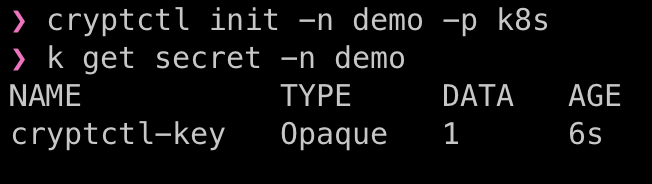
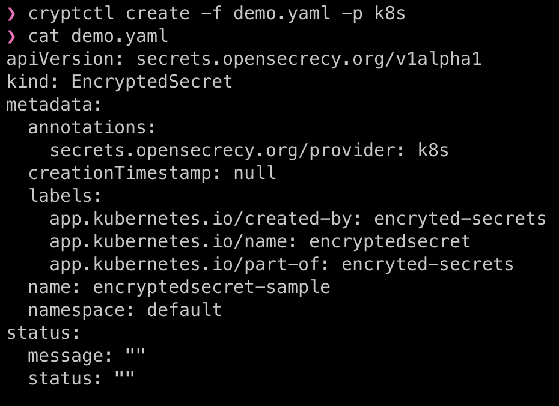

### **Create an encryption key**

```bash 
cryptctl init -n <namespace> -p k8s
```


### **Create an encrypted-secret manifest**

```bash
cryptctl create -f demo.yaml -p k8s
```


### **Edit encrypted-secrets manifest to add secret**
    
```bash
cryptctl edit demo.yaml
```
